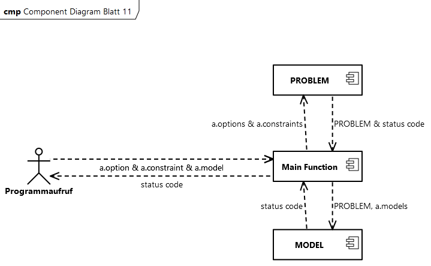

> [!Note]
>Full Project Documentation available at /Documentation/html/index.html


___

## Descritiption
This Project implements a soltuion for the pairwise testing method. It was created as coursework for the lecture [Programmieren in C++ 2023](https://cca.informatik.uni-freiburg.de/cpp/) at the University of Freiburg. The requirements can be found here: [requirements](https://daphne.informatik.uni-freiburg.de/ss2023/ProgrammierenCplusplus/svn-public/public/uebungen/project.pdf).
#### Status:
````diff
+ COMPLETE
````
___

## Contents:
1. Usage
2. Architecture
3. File Types
4. Status Codes

___

## Usage:

### checkerMain:
- This program is  created by runnung make compile, it will check a given set of .options, .constraints and .model files.
- The files "a.options", "a.constraints" and "a.models" can be used as sample inputs for the programm
- When running the programm it expects three arguments with the options and constraints file as well as the model files. If the program does not receive exactly three arguments it will result in an error message
- Example command to run the programm: 
  <span style="color:#4665A2">`./checkerMain a.options a.constraints a.models`</span>

### solverMain:
- This program is also created by running make compile, it will create a solution based on a  given set of .options and .constraints files.
- The files "a.options" and "a.constraints" can be used as sample inputs for the programm
- When running the programm it expects three arguments with the options and constraints file as well as a file name for the model file it will create. If the program does not receive exactly three arguments it will result in an error message
- Example command to run the programm: 
  <span style="color:#4665A2">`./solverMain a.options a.constraints a.models`</span>


### tests:
- This project contains integrated test suites for the CHECKER and SOLVER class. These check that all member functions are behaving as expected.
- "make Tests" will run both test suites in succession. During execution each test will report its status to the console and at the end of each suite a summary will report how many of the test groups were successfull.
- Example command to run the tests: 
  <span style="color:#4665A2">`make test`</span>


### parsePrintMain:
- This programm is rather useless, it parses a set of input files and prints exact copies with a different filename. It is however good for testing the PARSER and PRETTYPRINT class.
- This program can also be compiled using make compile
- The files "a.options" and "a.constraints" can be used as sample inputs for the programm
- When running the programm it expects four arguments with the options and constraints file as well as filenames where a copy of the will be saved. If the program does not receive exactly four arguments it will result in an error message
- Example command to run the programm: 
  <span style="color:#4665A2">`./parsePrintMain a.options a.constraints acopy.options acopy.constraints`</span>

### Verbose Output:
- Many parts of this project have the ability to send helpful messages for troubleshooting whenever something goes wrong. As these can be a bit annoying during normal operation they are disabled by default.
- To enable these there is a LOGGER::SetVerboseMode() function at the beginning of each main function. Verbose output is enabled by changing the function argument to true.
~~~{.cpp}
  //Set this to true to enable verbose logging to console
  LOGGER::SetVerboseMode(false);
~~~
___

## Architecture:

The main classes in this Project are PROBLEM and MODEL, they each have various helper classes for fascilitating various tasks. The Solver, Checker and parsePrint programs each have a main function which invoke a combination of these classes in order to achieve the desired outcome. An overview of the class contents is provided in the following class diagram:


### Solver


The solver offers the full functionality of the project. At first it creates an instance of the PROBLEM class and an instance of the MODEL class, which receives a reference to the instance of the PROBLEM class.
Next it calls the PARSER through the PROBLEM class to read in the input files. Following this the SOLVER is called through the MODEL class to calculate the solutions. Finally the CHECKER and PRETTYPRINT class are called through the MODEL class to check the models ands output them to a csv file.


### Checker


The checker is a stripped down version of the solver program, which reads in the .objects and .constraints file but instead of solving for the models file it also reads in a presolved .models file.This means that instead of engaging the SOLVER, the MODEL invokes the PARSER which reads in the models file and stores it in m_models. It then runs the checks over these models and reports any issues just like it would do in the main programm.

### parsePrint


This programm is rather useless, it parses a set of input files and prints exact copies with a different filename. It is however good for testing the PARSER and PRETTYPRINT class.
- First the main function takes in the file names from the command line  argument and creates an instance of the PROBLEM class to store these. 
- Next the parse funtion of the PROBLEM class is called. This triggers the parseOptions and parseConstraints functions of the PARSER class, which return the contents of the CSV files to the  PROBLEM class as 2-dimensional vectors.
- Next the main function calls the print function of the PROBLEM class, which triggers the printOptions and printConstraints functions of the PRETTYPRINT class. These access the vectors in the PROBLEM class in order to export them as CSV files to the output file names stored in the PROBLEM class.
  
___

## File Types:
### External Files:
#### .options Files:
These are CSV files, which store the available options for creating parinings. The first entry in each Row contains the name of the category, while the following entries contain the members of this category.
e.g:
|            |            |            |            |            |
|------------|------------|------------|------------|------------|
| Category A,| Element A1,| Element A2,| Element A3,| Element A4 |
| Category B,| Element B1,| Element B2 |            |            |
| Category C,| Element C1,| Element C2,| Element C3 |            |

~~Note: Contrary to the CSV standard quotation marks around elements are currently not ignored, this will be added in the next version.~~

Update: The parser now supports quotation marks around elements. This allows element names to also contain commas. Any quotation marks will be stripped from the parsed data and the printer will add them back if the data contained a comma.
#### .combinations Files:
These are CSV files, which store illegal combinations, which are to be considered when creating pairings. Each row contains one combination and is made up of alternating category names and element names. eg:

|           |         |           |         |           |         |
|---------- |---------|---------- |---------|---------- |---------|
| Category A,| Element, | Category B,| Element, | Category C,| Element |
| Category A,| Element, | Category C,| Element |           |         |
| Category B,| Element, | Category C,| Element |           |         |

#### .models Files:
These are CSV files, which store the solutions, which are created by the SOLVER. Each row contains one combination and is made up of alternating category names and element names and represents one possible solution to the problem. eg:

|           |         |           |         |           |         |
|---------- |---------|---------- |---------|---------- |---------|
| Category A,| Element, | Category B,| Element, | Category C, | Element |
| Category A,| Element, | Category C,| Element, | Category B, | Element |
| Category B,| Element, | Category C,| Element, | Category A, | Element |

### Internal Storage:
#### m_options vector
This is a two-dimenstional vector, which stores the data from the .options file as strings. Each inner vector contains the data from one row of the CSV file, where the first element is still the category name:
~~~{.cpp}
{{"Category A", "Element A1", "Element A2", "Element A3", "Element A4"},

{"Category B", "Element B1","Category B", "Element B2"},

{"Category C", "Element C1", "Category C", "Element C2", "Category C", "Element C3"}}  
~~~

#### m_combinations vector
This is a two-dimenstional vector, which stores the data from the .combinations file as strings. Each inner vector contains the data from one row of the CSV file:

~~~{.cpp}
{{"Category A", "Element", "Category B", "Element", "Category C", "Element A3"},

{"Category A", "Element","Category C", "Element"},

{"Category B", "Element", "Category C", "Element"}}
~~~

#### m_models vector
This is a two-dimenstional vector, which stores the data, which will be written to the .models file. Each inner vector contains the data from one row of the CSV file:

~~~{.cpp}
{{"Category A", "Element", "Category B", "Element", "Category C", "Element"},

{"Category A", "Element","Category C", "Element", "Category B", "Element"},

{"Category B", "Element", "Category C", "Element", "Category A", "Element}}
~~~
___

## Status Codes:
Most functions return a status code when they are executed. Internally the following status codes are used so that each issue can have a unique error code:
| Code | Meaning                                           |
|------|---------------------------------------------------|
| 0    | Program completed without issues                  |
| 10   | There was an issue when attempting to open a file |
| 20   | Invlaid .options file                             |
| 30   | Invalid .constraints file                         |
| 40   | Error in .models                                  |
| 50   | Other Error                                       | 
| 100  | Options file contains categories with one element, which must be treated 

The programms printParseMain, solverMain and checkerMain retrun the following status codes:

| Code | printParseMain                                    |
|------|---------------------------------------------------|
| 0    | Program completed without issues                  |
| 10   | There was an issue when attempting to open a file |

| Code | solverMain                                        |
|------|---------------------------------------------------|
| 0    | Program completed without issues                  |
| 10   | There was an issue when attempting to open a file |
| 20   | Invlaid input file                                |
| 30   | Other Error                                       |


| Code | checkerMain                                       |
|------|---------------------------------------------------|
| 0    | Program completed without issues                  |
| 10   | Invlaid .options file                             |
| 20   | Invalid .constraints file                         |
| 30   | Error in .models                                  |
| 40   | Other Error                                       | 

